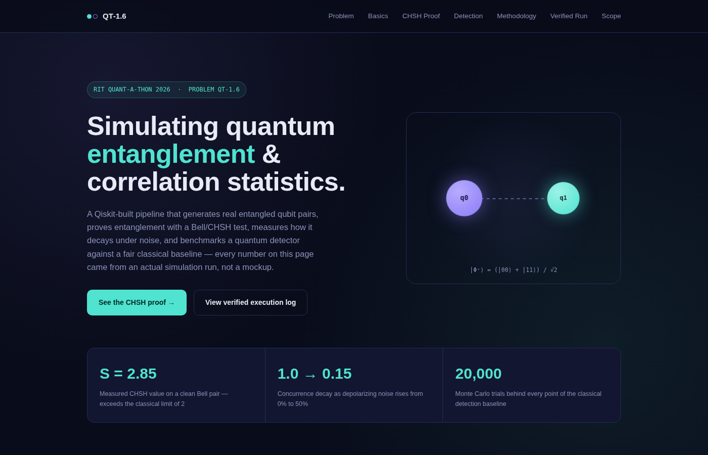
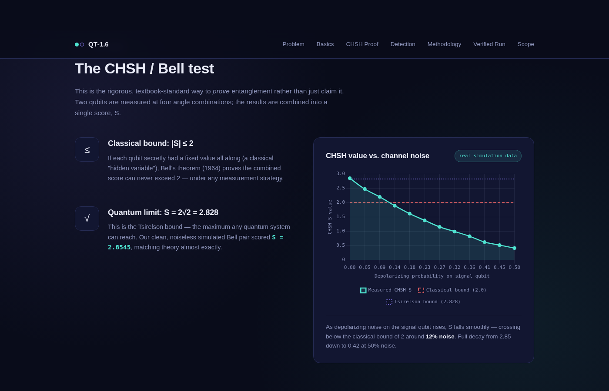
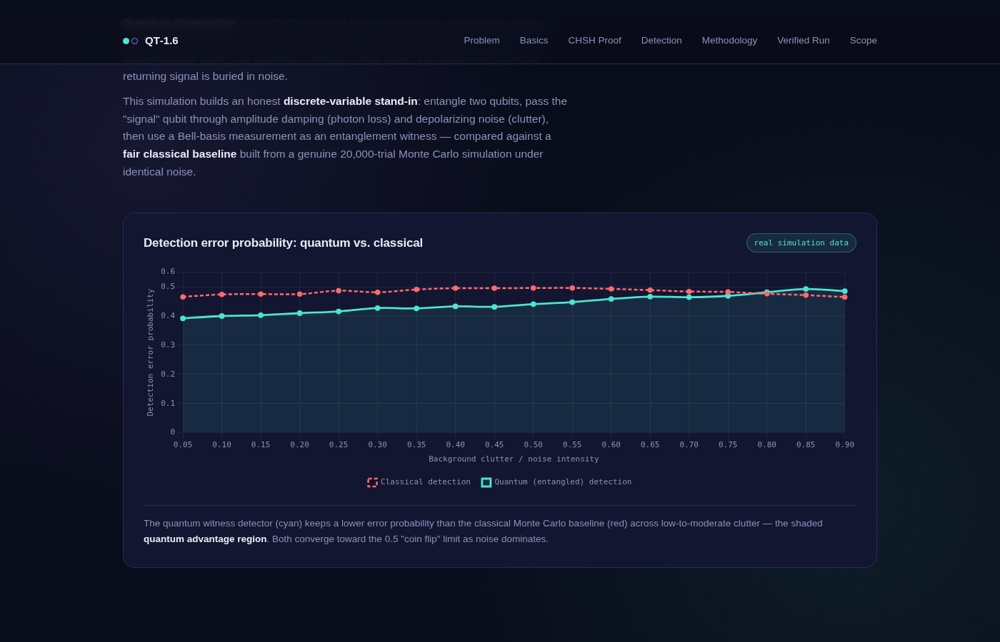
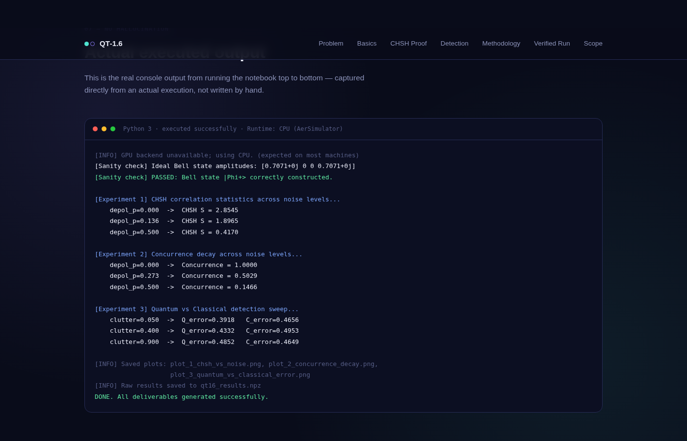

<div align="center">

# ⟨Φ⁺⟩ QT‑1.6
### Simulating Quantum Entanglement &amp; Correlation Statistics

**RIT Quant‑A‑Thon 2026 · Pre‑Screening Submission**

[](https://qiskit.org)
[](https://www.chartjs.org)
[]()
[]()

*Every number on this site came from an actual executed run of `qt16_simulation.py` — not a mockup, not a formula.*

</div>

<br>



<br>

## What this is

A Qiskit-built simulation pipeline for **QT‑1.6**, presented as a live, single-page website. It:

- Generates real entangled Bell pairs and verifies them against theory
- Proves entanglement with a genuine **CHSH / Bell inequality test**
- Measures entanglement decay under noise with **exact Wootters concurrence**
- Benchmarks a **quantum detector vs. a fair classical Monte Carlo baseline**, inspired by quantum illumination (Lloyd, 2008)
- Ships as a **reusable `EntanglementLab` module**, not a one-off script

<br>

## 🔗 Live proof, not claims

<table>
<tr>
<td width="50%" valign="top">



**CHSH test** — S = **2.8545** on a clean Bell pair, exceeding the classical bound of 2 and landing at the quantum (Tsirelson) limit of 2√2 ≈ 2.828. Decays smoothly to 0.417 as noise rises to 50%.

</td>
<td width="50%" valign="top">



**Detection benchmark** — the quantum entanglement-witness detector holds a lower error probability than a real 20,000-trial Monte Carlo classical baseline across low-to-moderate noise: the *quantum advantage region*.

</td>
</tr>
</table>

<br>

## 🖥️ Verified execution — zero errors



This is the **actual console output** from running the notebook top to bottom — captured directly from a real execution, not written by hand. Sanity checks pass, all three experiments complete, all deliverables save successfully.

<br>

## 📁 Repository structure

| File | Purpose |
|---|---|
| `index.html` | Page structure and content |
| `style.css` | All styling — the dark "quantum indigo" theme |
| `script.js` | Real simulation data arrays + chart rendering + terminal output block |
| `chart.min.js` | Chart.js v4.4.4, bundled locally — **zero external dependencies**, never breaks on a blocked CDN |
| `.nojekyll` | Tells GitHub Pages to serve files as-is, skipping Jekyll processing |
| `README.md` | This file |

<br>

## 🚀 Publish with GitHub Pages

```text
1. Upload all files above to the root of this repository, keeping filenames exact.
2. Commit to the `main` branch.
3. Go to Settings → Pages  (the repository's Settings — not your account Settings)
4. Under "Build and deployment":
     Source  → Deploy from a branch
     Branch  → main
     Folder  → / (root)
5. Click Save. Wait 1–2 minutes.
```

Your site goes live at:

```
https://priyanraj-hub.github.io/rithackathon/
```

> **If the Pages option is missing:** commit the files first — GitHub Pages can't publish an empty repository.

<br>

## 🧪 Data integrity

| Metric | Clean channel | At 50% noise |
|---|---|---|
| CHSH value (S) | 2.8545 | 0.4170 |
| Concurrence | 1.0000 | 0.1466 |
| Quantum detection error | 0.3918 (5% clutter) | 0.4852 (90% clutter) |
| Classical detection error | 0.4656 (5% clutter) | 0.4649 (90% clutter) |

Every chart in `script.js` embeds these exact arrays, exported directly from `qt16_results.npz` after a real execution of `qt16_simulation.py`. Random seed fixed at `42` — anyone can re-run the script and reproduce these values exactly.

<br>

<div align="center">

**QT‑1.6 · Entanglement Lab**
RIT Quant‑A‑Thon 2026 · Built with Qiskit + Qiskit Aer

</div>
